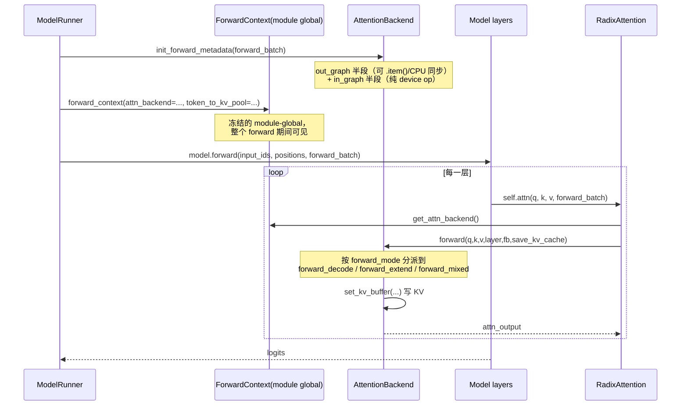

# SGLang Attention Backend 全景方案

> 代码基线：`33ed29a0ee`（`test: update hybrid attention runner fixtures (#37345)`）
> 主目录：`python/sglang/srt/layers/attention/`

本文系统梳理 SGLang 的 attention backend 子系统：它是什么、怎么被选出来、怎么被构造、
运行时怎么被调用、怎么和 CUDA Graph / 投机解码 / MLA / 线性注意力配合，以及新增一个
backend 需要实现哪些契约。

阅读建议：先看第 1 章拿到心智模型，再按需跳读。

---

## 目录

1. [总览：三个抽象层次](#1-总览三个抽象层次)
2. [`AttentionBackend` ABC：全部契约](#2-attentionbackend-abc全部契约)
3. [选型流水线：从 ServerArgs 到具体类](#3-选型流水线从-serverargs-到具体类)
4. [运行时调用链：ambient context 与 RadixAttention](#4-运行时调用链ambient-context-与-radixattention)
5. [ForwardBatch / ForwardMode：backend 消费的字段](#5-forwardbatch--forwardmode)
6. [CUDA Graph 集成契约](#6-cuda-graph-集成契约)
7. [组合式 backend：两条正交的拆分轴](#7-组合式-backend两条正交的拆分轴)
8. [Leaf backend 的三大结构族](#8-leaf-backend-的三大结构族)
9. [MLA 专章：一层两个 RadixAttention](#9-mla-专章一层两个-radixattention)
10. [KV 索引与写入契约](#10-kv-索引与写入契约)
11. [支撑模块](#11-支撑模块)
12. [新增一个 backend 的 checklist](#12-新增一个-backend-的-checklist)
13. [已知 wart 与调试线索](#13-已知-wart-与调试线索)

---

## 1. 总览：三个抽象层次

### 1.1 attention backend 到底是什么

在 SGLang 里，模型代码（`models/llama.py`、`models/deepseek_v2.py` …）**不直接写
attention kernel**。模型只持有一个 `RadixAttention` 模块（`layers/radix_attention.py`），
调用形如：

```python
attn_output = self.attn(q, k, v, forward_batch)
```

`RadixAttention` 本身也不含 kernel，它只是把「这一层的静态属性」（head 数、`scaling`、
`layer_id`、是否 sliding window、`AttentionType`）打包好，转手交给当前生效的
**attention backend**：

```python
# layers/radix_attention.py:289-298（直连路径）
return get_attn_backend().forward(q, k, v, self, forward_batch, save_kv_cache, **kwargs)
```

所以 backend 的职责边界很清晰：

| 关注点 | 归属 |
|---|---|
| 一层的静态形状/缩放/mask 类型 | `RadixAttention`（模型侧构造） |
| 这一步 batch 的序列长度、页表、索引 | `ForwardBatch` + backend 的 `forward_metadata` |
| 真正的 kernel 调用与 KV 写入 | attention backend |
| KV cache 存储与 slot 分配 | `mem_cache/` 的 pool / allocator |

一句话：**backend = 「把 (q,k,v,层属性,batch 元信息) 变成 attention 输出」的可替换实现，
外加一份「为这一步 batch 预计算的元数据」的生命周期管理**。

### 1.2 三个抽象层次

整个子系统可以按「谁包着谁」分成三层：

```
┌─ 第 3 层：组合器（composite / wrapper backend）────────────────────┐
│  HybridLinearAttnBackend / MiniMaxHybridAttnBackend               │
│  DotsHybridAttnBackend        ← 按【层】拆分                        │
│    └─┬─ HybridAttnBackend     ← 按【forward mode】拆分（prefill/decode）│
│      │  TboAttnBackend        ← 按【micro-batch】拆分               │
│      ▼                                                            │
│  ┌─ 第 2 层：leaf backend（真正调 kernel）──────────────────────┐  │
│  │  FlashAttentionBackend / TritonAttnBackend                  │  │
│  │  FlashInferAttnBackend / FlashInferMLAAttnBackend           │  │
│  │  TRTLLMMLABackend / FlashMLABackend / CutlassMLABackend ... │  │
│  │  NativeSparseAttnBackend(DSA) / DSV4AttnBackend             │  │
│  │  TorchNativeAttnBackend（教学参考实现）                       │  │
│  │  ┌─ 第 1 层：AttentionBackend ABC ─────────────────────────┐ │  │
│  │  │  base_attn_backend.py：契约 + 默认实现 + 能力标志         │ │  │
│  │  └────────────────────────────────────────────────────────┘ │  │
│  └────────────────────────────────────────────────────────────┘  │
└──────────────────────────────────────────────────────────────────┘
```

关键认知：**第 3 层的两条拆分轴是正交的，且会嵌套组合**——层轴的 wrapper 在外，
mode 轴的 wrapper 在内（详见第 7 章）。

### 1.3 一次 forward 的完整时序（先看骨架）



要点：

- **元数据准备发生在模型 forward 之前，且只做一次**（不是每层一次）。所有层共享
  同一份 `backend.forward_metadata`；层间差异（sliding window、MLA 的 mqa/mha）通过
  `layer` 参数与 metadata 里的多套字段区分。
- **backend 不通过 `forward_batch` 传递**。历史上有 `forward_batch.attn_backend`，
  现在已彻底移除（全仓 0 处引用）；改为 module-global 的 `ForwardContext` +
  `get_attn_backend()`（`model_executor/forward_context.py:66`）。同理
  `token_to_kv_pool` / `req_to_token_pool` 也从 context 取。

---

## 2. `AttentionBackend` ABC：全部契约

文件：`python/sglang/srt/layers/attention/base_attn_backend.py`（342 行）

这是全子系统的唯一基类。它把契约分成 6 组。

### 2.1 元数据初始化：三段式

这是**最重要的契约**，也是近期改动最大的地方。旧版的
`init_forward_metadata_capture_cuda_graph` / `..._replay_cuda_graph` 这一对方法**已被删除**，
统一成三个方法：

```python
# base_attn_backend.py:88-130
def init_forward_metadata(self, forward_batch: ForwardBatch):
    """默认实现 = out_graph(in_capture=False) + in_graph"""
    self.init_forward_metadata_out_graph(forward_batch, in_capture=False)
    self.init_forward_metadata_in_graph(forward_batch)

def init_forward_metadata_out_graph(self, forward_batch, in_capture: bool):
    """graph 外半段：允许 CPU 同步、allocate、.item()、.tolist()"""

def init_forward_metadata_in_graph(self, forward_batch):
    """graph 内半段：必须是纯 device-side op
       禁止：.item() / .cpu() / .tolist() / 动态 torch.empty()"""
```

三段式的动机是 **CUDA Graph**：

| 方法 | eager 路径 | CUDA Graph capture | CUDA Graph replay |
|---|---|---|---|
| `init_forward_metadata` | 调用（= 两半段） | — | — |
| `..._out_graph(in_capture=True)` | — | capture 前调用一次 | 每次 replay 前调用（在 graph 之外） |
| `..._in_graph` | — | 在 capture 区间内调用（被录进 graph） | **不调用**，由 graph 自动重放 |

也就是说：**能在 device 上纯张量运算完成的元数据准备，应尽量下沉到 `in_graph`，
这样它会被录进 CUDA Graph，replay 时零 CPU 开销**；必须 CPU 参与的（比如根据
`seq_lens` 的最大值决定 split 数量）留在 `out_graph`。

`base_attn_backend.py:124-127` 明文写下了 `in_graph` 的 lint 契约：

```python
# In-graph metadata preparation must be pure device-side work:
#   - no .item() / .cpu() / .tolist()
#   - no dynamic torch.empty() (allocations must be pre-made in
#     init_cuda_graph_state)
```

**实际实现分布**（容易记错，这里点明）：

- 真正两半段都实现的只有 `FlashAttentionBackend`（`init_forward_metadata_in_graph`
  在 `flashattention_backend.py:427-453`）和 `TRTLLMHAAttnBackend`。
- **`TritonAttnBackend` 没有覆写 `init_forward_metadata_in_graph`**，用的是基类空实现；
  `decode_cuda_graph_runner.py:1189` 处的注释明确了这一点。Triton 走的是
  `_apply_cuda_graph_metadata` 把预分配 buffer 原地填好的老路子。
- `TritonMultiStepDraftBackend` 有一个 `in_graph`（`triton_backend.py:2194-2196`），但只是
  往子 backend 扇出，不含实质逻辑。
- 投机解码的 draft-extend 另有一个钩子 `draft_extend_metadata_captured_in_graph`
  （`base_attn_backend.py:132-137`），声明「draft extend 的元数据是否已录进 graph」。

### 2.2 forward 分派

```python
# base_attn_backend.py:248-291
@debug_kernel_api
def forward(self, q, k, v, layer, forward_batch, save_kv_cache=True, **kwargs):
    if forward_batch.forward_mode.is_idle():
        return q.new_empty(q.shape[0], layer.tp_q_head_num * layer.v_head_dim)
    elif forward_batch.forward_mode.is_decode():
        return self.forward_decode(q, k, v, layer, forward_batch,
                                   save_kv_cache=save_kv_cache, **kwargs)
    elif forward_batch.forward_mode.is_mixed() and is_npu():
        return self.forward_mixed(...)
    else:
        return self.forward_extend(...)
```

四点值得注意：

1. **IDLE 是在基类统一短路的**，返回形状正确的空张量。子类不需要处理空 batch。
   这是 DP attention 下某些 rank 无请求时的路径。
2. `is_decode()` 覆盖的不只是纯 decode，还包括投机解码的 `TARGET_VERIFY` 等（取决于
   `ForwardMode` 的谓词定义，见第 5 章）。
3. **`forward_mixed` 只在 NPU 上启用**（`is_npu()` 硬门禁）。CUDA/ROCm 上 MIXED 走
   `forward_extend`。
4. 装饰器 `@debug_kernel_api` 是 CUDA crash 定位用的 kernel API 日志钩子——所有 backend
   的 forward 入口都天然被覆盖。

三个 `forward_*` 在基类里都是 `raise NotImplementedError`（`:293-329`）。

### 2.3 能力标志（class attribute 矩阵）

这批 class 级布尔量是「runner 怎么对待我」的声明式配置。**新增 backend 时最容易漏的就是这些。**

| 属性 | 默认 | 位置 | 含义 |
|---|---|---|---|
| `prefill_attention_backend_str` | `None` | `:60` | 供 `HybridAttnBackend` 记录自己的 prefill 子后端名 |
| `decode_attention_backend_str` | `None` | `:61` | 同上，decode 侧 |
| `supports_ragged_verify_graph` | `False` | `:63` | 是否支持投机 verify 阶段的 ragged CUDA graph |
| `data_type` | `None` | `:68` | q/o dtype，供上层查询 |
| `kv_cache_dtype` | `None` | `:69` | KV cache dtype（可与 `data_type` 不同，如 fp8 KV） |
| `attn_backend_list` | `None` | `:75` | **组合器专用**：子 backend 列表，用于元数据/graph 扇出 |
| `forward_metadata` | `None` | `:80` | 当前步的元数据对象（各 backend 自定义类型） |
| `kv_index_translator` | `None` | `:86` | KV 索引翻译器，见第 10 章 |
| `needs_cpu_seq_lens` | `True` | `:140` | 是否需要 CPU 侧 `seq_lens`（影响 overlap 调度能否免同步） |
| `extend_dummy_seqs_capped_by_req_pool` | `False` | `:145` | warmup 造假 batch 时，dummy 序列数是否受 req pool 上限约束 |
| `use_captured_forward_metadata_for_breakable_cuda_graph` | `False` | `:152` | BCG（breakable CUDA graph）下是否复用 capture 期元数据 |
| `supports_full_cuda_graph_chunked_prefix` | `False` | `:175` | 是否支持 full-CG 下的 chunked prefix（MLA 相关） |

`needs_cpu_seq_lens` 是性能敏感项：overlap 调度器通过
`managers/overlap_utils.py:decide_needs_cpu_seq_lens`（`:26-51`）聚合所有 backend 的诉求，
只要有一个 backend 要 CPU `seq_lens`，就必须插入 D2H 同步。因此**新 backend 若能纯 device
侧工作，务必显式设 `needs_cpu_seq_lens = False`**。

### 2.4 CUDA Graph 相关方法

```python
def init_cuda_graph_state(self, max_bs, max_num_tokens, kv_indices_buf=None)  # :192-194，基类 raise
def get_cuda_graph_seq_len_fill_value(self) -> int                            # :219-221，基类 raise
def on_after_cuda_graph_warmup(self)                                          # :223-230，默认 no-op
```

- `init_cuda_graph_state`：**decode 侧独有**。prefill CUDA graph runner 从不调用它。
  职责是把所有 replay 期要用的 buffer 一次性预分配到最大 shape（因为 `in_graph` 阶段
  禁止动态分配）。
- `get_cuda_graph_seq_len_fill_value`：CUDA graph 的 batch 是定长 padding 的，padding 出来
  的假请求 `seq_len` 填什么值由 backend 说。FlashInfer 系一般填 `0`，Triton/FA 系填 `1`
  （避免 0 长度导致 kernel 除零或 indptr 退化）。填错的典型表现是 replay 出 NaN 或非法内存访问。
- BCG（breakable CUDA graph）三个地址稳定性钩子在 `:196-217`，基类 raise；只有支持 BCG 的
  backend（如 `DSV4AttnBackend`，`deepseek_v4_backend.py:1531-1558`）才实现。

### 2.5 `SharedReadEnds`：与 overlap 调度器的 WAR 栅栏

这是全文最容易被忽略、但踩坑代价最大的契约。

```python
# base_attn_backend.py（枚举定义）
class SharedReadEnds(Enum):
    PRE_REPLAY = 1    # 读结束于 init_forward_metadata_out_graph 之后
    IN_REPLAY = 2     # 读结束于 init_forward_metadata_in_graph 之后
    POST_REPLAY = 3   # 元数据快照未实现 → 读贯穿整个 forward
    UNKNOWN = 4       # 未审计 → 退化为最粗的「整个 forward」栅栏

    @staticmethod
    def max_of(items):
        return max(items, key=lambda x: x.value)
```

**问题背景**：overlap 调度器会在 GPU 还在跑第 N 步时，就在 CPU 侧准备第 N+1 步的
`ScheduleBatch`，并可能改写共享张量（`req_to_token`、`seq_lens` 等）。如果 backend 的
kernel 还在读这些张量，就是典型的 WAR（write-after-read）竞争。

**解法**：每个 backend 通过 `shared_read_ends()`（`:154-159`）声明「我最晚读到什么时候」，
runner 据此在正确的位置插一个 event 让写方等待。声明越早，overlap 窗口越大、性能越好。

runner 侧的实现：

- `decode_cuda_graph_runner.py:518-526` `_resolve_shared_read_ends()`：对组合器取
  `SharedReadEnds.max_of(子 backend 的声明)`——**取最保守的那个**。
- `:528-537` `_publish_read_done()`：在对应时点 record event。
- `:1457-1485` `execute()` 里按解析结果分派到不同的栅栏位置。
- event 实现在 `model_executor/runner_utils/shared_read_event.py:16-52`。

**已知不健全之处（代码自己标了 TODO）**：当 `torch.cuda.Event(external=True)` 不可用时，
`IN_REPLAY` 会**静默降级为 `PRE_REPLAY`**，而 `PRE_REPLAY` 比声明的时点**更早**，理论上
不安全。`decode_cuda_graph_runner.py:518-526` 的注释原话是
`# TODO: this lands EARLIER than declared; POST_REPLAY is the sound one.`
所以不要把它当成一个干净的四级阶梯来理解——它是三个可用等级加一个 fallback，且 fallback 方向是错的。

另有 `prepare_prefill_shared_read_snapshot`（`:161-169`）：prefill 侧的对应机制，backend 可以
把要读的东西快照一份，从而彻底解除依赖。

### 2.6 投机解码与 sparse 钩子

```python
@property
def verify_mask(self)                                    # :232-235
def update_verify_buffers_to_fill_after_draft(...)       # :237-246，基类 raise
def get_indexer_metadata(self, ...)                      # :335-341，默认 None
def support_triton(self) -> bool                         # :331-333，默认 True
```

- `verify_mask`：投机解码 target-verify 阶段的树状 causal mask。默认从
  `layers/attention/verify_mask.py` 拿预分配的共享 buffer（见第 11 章）。
- `update_verify_buffers_to_fill_after_draft`：draft 结束、verify 开始前，把 draft token 的
  长度信息补进 verify 的元数据 buffer。只有参与投机路径的 backend 需要实现。
- `get_indexer_metadata`：**sparse attention 专用**。DSA / DSV4 的 indexer（topk 选择器）
  需要一份自己的元数据；返回非 `None` 表示「我是 sparse backend，模型侧可以来取 indexer 元信息」。
- `support_triton`：某些 backend（如纯 CUDA kernel 的）会返回 `False`，用来关掉依赖 Triton
  的旁路优化。

---

## 3. 选型流水线：从 ServerArgs 到具体类

从命令行 `--attention-backend fa3` 到内存里一个具体对象，中间要过 9 道关。这是整个
子系统最绕的部分，先给全景图：

```
① 用户 CLI / 默认值
   server_args.attention_backend / prefill_attention_backend / decode_attention_backend
   --speculative-draft-attention-backend / --speculative-attention-mode
        │
② arg_groups pipeline（一串 hook / pass 顺序执行，改写 ServerArgs）
   arg_groups/pipeline.py:236-346 定义 hook 顺序
   ├─ overrides.py::_attention_backend_default        ← 硬件×模型默认矩阵入口
   ├─ overrides.py::_mla_backend_page_constraints     ← page_size 约束
   ├─ overrides.py::_attention_backend_platform_fallbacks
   ├─ attention_hook.py::handle_attention_backend_compatibility
   ├─ attention_hook.py::handle_linear_attn_backend
   ├─ attention_hook.py::handle_deterministic_inference
   ├─ kv_cache_hook.py                                ← KV dtype / page-major allow-list
   └─ speculative_hook.py                             ← draft backend 解析
        │
③ ModelRunner.__init__ 里先 resolve 再 build（顺序是承重墙）
   model_runner.py:275-289  resolve_draft_attention_backend()  ← 在 :347-350 调用
   model_runner.py:993-1020 init_attention_backends()          ← 注意是复数
        │
④ resolve_attention_backend_strs()   attention_backend_setup.py:158-178
   把 (attention_backend, prefill_*, decode_*) 归一成 ResolvedAttentionBackendStr
        │
⑤ build_attention_backends()         attention_backend_setup.py:69-143
   按 PDMUX(:85-97) / TBO(:98-109) / 单实例(:110-115) 三种拓扑分别构造
        │
⑥ _build_resolved_backend()          attention_backend_setup.py:181-235
   若 prefill≠decode → 包 HybridAttnBackend(:193-219)；否则直连
        │
⑦ attn_backend_wrapper()             attention_registry.py:344-535
   线性注意力 / MoE-hybrid / sparse 的【层轴】包装
        │
⑧ registry factory                   attention_registry.py 各 @register_attention_backend
   name → 具体类实例，同时做硬件与参数硬校验
        │
⑨ translator 自检                    model_runner.py:1014-1016
   assert_backends_carry_translator()：确认所有 leaf 都拿到了 KVIndexTranslator
```

### 3.1 ① 入口参数

`server_args.py` 相关声明：

| 参数 | 位置 | 说明 |
|---|---|---|
| `--attention-backend` | `:1657-1688` | 全局后端名；不指定则走默认矩阵 |
| `--prefill-attention-backend` | 同上 | 只作用于 extend/prefill |
| `--decode-attention-backend` | 同上 | 只作用于 decode |
| `--speculative-draft-attention-backend` | `:2178-2185` | draft 模型的后端 |
| `--speculative-attention-mode` | `~:2168-2177` | 取值 `prefill` \| `decode`，决定 draft 用哪套元数据形态 |

**注意**：**没有 `--speculative-attention-backend` 这个参数**（容易和上面两个混淆）。
候选名常量表在 `server_args.py:171-246`。

### 3.2 ② 默认矩阵：`get_default_attn_backend`

权威实现在 `arg_groups/model_override_base.py:273-346`。这是「用户没指定时用什么」的
唯一决策点，按 `(硬件平台, 是否 MLA 模型, SM 版本, dtype)` 决策。要点：

- CUDA + 非 MLA：优先 `fa3`（要求 SM ≥ 90，`attention_registry.py:215-238` 有断言），
  否则退 `flashinfer`，再退 `triton`。
- CUDA + MLA：走 MLA 家族（`flashinfer_mla` / `trtllm_mla` / `flashmla` / `cutlass_mla`），
  按 SM 与 page_size 细分。
- ROCm：`aiter`（`aiter_backend.py`，137KB）。
- NPU：`ascend`；XPU：`xpu_backend.py`；CPU：`intel_amx` / `torch_native`。

配套的兜底规则在 `model_override_base.py:164-178` 的 `attention_backends_of`：
**`prefill_attention_backend` / `decode_attention_backend` 未设时，回落到 `attention_backend`。**
（这两个函数以及 `resolved_view`（`:153-161`）**定义在 `model_override_base.py`**，
`overrides.py:57` 只是 re-export，看代码时别在 `overrides.py` 里找定义。）

### 3.3 ② 各 pass / hook 的具体职责

`arg_groups/overrides.py` 里与 attention 相关的 pass：

| pass | 位置 | 做什么 |
|---|---|---|
| `_attention_backend_default` | `:1111-1124` | 调用默认矩阵填空 |
| `_mla_backend_page_constraints` | `:1128-1204` | 各 MLA 后端对 `page_size` 的硬约束（如 `flashmla` 要 64、`cutlass_mla` 要 128） |
| `_mla_kv_cache_dtype_checks` | `:1208-1238` | MLA + fp8 KV 的组合合法性 |
| `_cutedsl_prefill_backend_fill` | `:1253-1282` | CuteDSL MLA 只做 decode，prefill 自动补一个后端 |
| `_attention_backend_fa3_fp8_fallback` | `:1286-1293` | fa3 遇到不支持的 fp8 组合时降级 |
| `_fa4_page_constraint` | `:1297-1315` | fa4 的 page_size 约束 |
| `_attention_backend_platform_fallbacks` | `:1319-1338` | 平台不支持时的整体降级链 |
| `_intel_xpu_page_constraint` | `:1342-1356` | XPU page_size |
| `_attention_backend_dual_chunk` | `:1360-1373` | dual-chunk（长上下文）后端切换 |
| `_dsa_split_backend_resolution` | `:669-753` | DSA（DeepSeek sparse attention）的 prefill/decode 分裂解析 |
| `_deterministic_attention_backend` | `:1077-1107` | 确定性推理模式下强制可复现后端 |

`arg_groups/attention_hook.py` 里的四个大 hook：

| hook | 位置 | 做什么 |
|---|---|---|
| `handle_attention_backend_compatibility` | `:43-229` | 最大的一个：逐项检查后端×特性组合（spec / DCP / SWA / multi-item scoring / CUDA graph）。例如 `torch_native` 在 `:57-66` 直接关掉 decode CUDA graph |
| `handle_linear_attn_backend` | `:232-459` | Mamba/GDN/KDA/short-conv 等线性注意力后端名解析与允许列表 |
| `handle_multi_item_scoring` | `:462-513` | 多 item 打分（rerank 场景）需要特定 mask 支持 |
| `handle_deterministic_inference` | `:516-636` | 确定性推理：固定 split 数、禁用非确定性 reduce |

`arg_groups/kv_cache_hook.py` 与 attention 强耦合的部分：

- `:36-109`：KV4（4-bit KV）支持的后端白名单。
- `:196-280`：统一 KV pool 的启用条件，含 DSPARK allow-list（`:239-248`）。
- `:283-392`：page-major KV 布局的后端白名单（`:329-358`、`:371-387`）——布局和 kernel 是绑定的，
  不在白名单里的后端不能用 page-major。

hook 的执行顺序定义在 `arg_groups/pipeline.py:236-346`。**顺序是语义的一部分**：
默认值填充必须在约束检查之前，约束检查必须在 KV 布局决策之前。

### 3.4 ③ `ModelRunner` 侧：resolve 先于 build

```python
# model_runner.py（简化）
self.use_mla_backend = ...                        # :371
...
self.resolve_draft_attention_backend(...)         # 定义 :275-289，调用 :347-350
...
self.init_kv_index_translator(...)                # 定义 :860-870，调用 :898
...
self.init_attention_backends()                    # :993-1020
```

三个易错点：

1. **方法名是 `init_attention_backends`（复数）**，在 `model_runner.py:993`。
   单数形式 `init_attention_backend` 只存在于投机 worker（`eagle_worker_v2.py:329`）。
2. **`resolve_draft_attention_backend` 必须在 build 之前**。它把 draft 后端名解析定下来，
   build 阶段直接读结果；顺序颠倒会拿到未解析的 `None`。
3. **`init_kv_index_translator` 必须在 build 之前**（`:898` < `:993`），因为 build 出来的每个
   leaf backend 都要挂上 translator，随后 `:1014-1016` 会 assert 检查：

```python
# model_runner.py:1014-1016
assert_backends_carry_translator(self.attn_backends, ...)
```

漏挂 translator 的表现是启动期直接 assert 失败——这是有意设计的早期失败点。

其他相关入口：`_get_attention_backend`（`:1408`）、`update_decode_attn_backend`
（`:1474-1475`，PDMUX 场景切换 decode 后端）、`forward_split_prefill`（`:1546-1566`）。

### 3.5 ④⑤⑥ `attention_backend_setup.py`

文件：`model_executor/model_runner_components/attention_backend_setup.py`

两个数据结构（`:26-38`）：

```python
class ResolvedAttentionBackendStr:   # 解析后的名字三元组
    prefill: str
    decode: str

class AttentionBackends:             # build 的产物
    ...   # 可能是 1 个、也可能是 PDMUX/TBO 下的多个
```

`build_attention_backends()`（`:69-143`）按拓扑三分支：

| 分支 | 位置 | 场景 |
|---|---|---|
| PDMUX | `:85-97` | prefill/decode 复用同卡（PD multiplexing），需要两套独立 backend 实例 |
| TBO | `:98-109` | two-batch overlap，每个 micro-batch 一套，外面再包 `TboAttnBackend` |
| 单实例 | `:110-115` | 常规路径 |

`_build_resolved_backend()`（`:181-235`）是关键分歧点：

```python
if resolved.prefill != resolved.decode:
    # :193-219 —— 包 HybridAttnBackend
    prefill_be = _build_backend_from_str(resolved.prefill, ...)
    decode_be  = _build_backend_from_str(resolved.decode, ...)
    backend = HybridAttnBackend(prefill_be, decode_be, ...)
else:
    backend = _build_backend_from_str(resolved.prefill, ...)
```

`:198-203` 有一条重要注释：**层轴的 `attn_backend_wrapper` 只包一次**——即当 prefill/decode
不同时，wrapper 要包在 `HybridAttnBackend` 外面，而不是分别包两个子后端。这就是第 1.2 节
说的「层轴在外、mode 轴在内」的代码依据。

辅助函数：`_build_backend_from_str`（`:238-248`）、`_build_full_attention_backend_from_str`
（`:251-257`，跳过层轴包装，专供 hybrid-linear 模型取「全注意力那一半」）。

### 3.6 ⑦ `attn_backend_wrapper`：层轴包装

`attention_registry.py:344-535`，近 200 行的决策树。按模型族分支：

| 分支 | 位置 | 产物 |
|---|---|---|
| Dots 系（MoE + SWA MLA） | `:356-359` | `DotsHybridAttnBackend` |
| MiniMax sparse | `:361-370` | `MiniMaxHybridAttnBackend` |
| 「mambaish」大分支 | `:372-533` | `HybridLinearAttnBackend` / `ShortConvHybridAttnBackend` |

mambaish 分支内部再细分：

- Inkling short-conv：`:375-387`
- Blackwell GDN allow-list：`:436-447`（GDN 在 Blackwell 上只允许特定后端组合）
- NPU 上强制 ascend：`:448-452`（assert，不是降级）
- Mamba2 / ZAYA / LFM2 short-conv：`:465-493`，其中 NPU 直接
  `raise NotImplementedError`（`:478-484`）
- KDA：`:496-506`
- lightning attention：`:507-508`
- registry 兜底：`:510-525`
- **draft 模型特例**：`:526-530` 强制 `full_attn_layers=[0]`——draft 只有一层参与全注意力
- 收口：`:531-533`

```python
# attention_registry.py:531-533
return hybrid_backend_cls(full_attn_backend, linear_attn_backend, full_attn_layers)
```

另有两个投机专用 wrapper：`attn_backend_wrapper_for_draft_extend`（`:299-315`）与
`attn_backend_wrapper_for_draft_decode`（`:318-327`）。

### 3.7 ⑧ registry：注册与硬校验

```python
# attention_registry.py:39-47
ATTENTION_BACKENDS = {}

def register_attention_backend(name):
    def decorator(fn):
        ATTENTION_BACKENDS[name] = fn
        return fn
    return decorator
```

约 25 个注册名。**每个 factory 除了实例化，还承担「这个组合到底行不行」的最后一道硬校验**
（前面的 arg_groups hook 是「尽量修好」，这里是「修不好就报错」）：

| 名字 | factory 位置 | 硬校验 |
|---|---|---|
| `flashinfer` | `:50-74` | 按 `use_mla_backend` 分叉到 MLA 版；EAGLE 时在 `:60-65` 给 runner 挂 `plan_stream_for_flashinfer` |
| `trtllm_mla` | `:77-93` | 拒绝 DCP + spec 组合 |
| `dsv4` | `:157-180` | NPU / HIP / CUDA 三个变体分别导入不同类 |
| `nsa` | `:146-154` | 已废弃的别名，指向 DSA |
| `triton` | `:183-191` | — |
| `fa3` | `:215-238` | SM 版本断言 |
| `trtllm_mha` | `:257-263` | — |
| `hpc_ops` | `:266-280` | — |

### 3.8 投机解码的独立选型链

draft 模型的 backend **不复用** target 的对象，而是由
`speculative/draft_utils.py:DraftBackendFactory`（`:28-539`）另建一套：

- `_create_backend`（`:42-77`）：底层构造
- `create_decode_backend`（`:79-112`）：多步 draft decode（配 `*MultiStepDraftBackend`）
- `create_draft_extend_backend`（`:114-157`）：draft 的 extend 形态

调用点：`speculative/draft_worker_common.py:32-105`；参数解析在
`arg_groups/speculative_hook.py:541-613` 与 `:739-743`。

关于 plan stream 的一个澄清：**没有名为 `plan_stream_for_flashinfer` 的「机制」**，
真正的 plan-stream 获取函数是 `speculative/spec_utils.py:1060-1068` 的 `get_plan_stream(device)`，
受 `envs.SGLANG_ENABLE_OVERLAP_PLAN_STREAM` 控制，由 EAGLE-v2 worker 族使用，
在 `eagle_worker_common.py:509` 处 join。不过 `attention_registry.py:60-65` 确实会给 runner
赋一个 `plan_stream_for_flashinfer = torch.cuda.Stream()` 属性——那是个属性，不是调度机制。

---

## 4. 运行时调用链：ambient context 与 RadixAttention

### 4.1 `ForwardContext`：backend 的发布方式

文件：`model_executor/forward_context.py`（85 行）

```python
@dataclass(frozen=True)          # :34-40
class ForwardContext:
    attn_backend: AttentionBackend
    token_to_kv_pool: ...
    req_to_token_pool: ...
    ...

_current: ForwardContext | None = None     # :43 module-global

def get_attn_backend():        return _current.attn_backend        # :66
def get_token_to_kv_pool():    return _current.token_to_kv_pool    # :70
def get_req_to_token_pool():   return _current.req_to_token_pool   # :74

@contextmanager
def forward_context(...):      # :78
    ...
```

设计意图：**避免把 backend 塞进 `ForwardBatch` 沿调用栈层层传递**。
`forward_batch.attn_backend` 这个字段已经彻底删除（全仓 grep 0 命中）。
发布点在 `model_runner.py:_forward_raw`（`:1712`）内部的 `:1719-1722`：

```python
with forward_context(attn_backend=..., token_to_kv_pool=..., req_to_token_pool=...):
    ...  # 模型 forward 全程可见
```

`frozen=True` 是关键：context 在一次 forward 内不可变，任何层读到的都是同一份。

### 4.2 `RadixAttention`：静态属性容器 + 双路径

文件：`layers/radix_attention.py`（658 行）

构造期固定下来的属性（`:103-155`）：

```python
class RadixAttention(nn.Module):
    def __init__(self, num_heads, head_dim, scaling, num_kv_heads, layer_id,
                 sliding_window_size=-1, is_cross_attention=False,
                 quant_config=None, attn_type=AttentionType.DECODER,
                 v_head_dim=-1, use_irope=False, prefix="", ...):
```

`AttentionType` 枚举（`:84-96`）：`DECODER`（causal）/ `ENCODER_ONLY`（双向）等，
backend 据此决定 mask。

`forward`（`:157-298`）有两条路：

```python
# 简化后的结构
def forward(self, q, k, v, forward_batch, save_kv_cache=True, **kwargs):
    if <走 split-op 路径>:            # :176-288
        # 注册成 custom op，便于 torch.compile 切图 / CUDA graph 分段
        return torch.ops.sglang.unified_attention_with_output(...)
    # 直连路径 :289-298
    return get_attn_backend().forward(q, k, v, self, forward_batch,
                                      save_kv_cache, **kwargs)
```

- **直连路径**（`:289-298`）：最常见，一行转发给 backend。
- **split-op 路径**（`:176-288`）：把 attention 包装成注册过的 custom op
  （`_unified_attention_with_output_impl` 在 `:301-423`，注册代码 `:426-657`），
  这样 `torch.compile` 能正确处理 KV cache 副作用、CUDA graph 能在 op 边界切分。

线性注意力有平行的一套：`layers/radix_linear_attention.py` 的
`_linear_attention_with_output_impl`（`:151-185`）。

### 4.3 元数据生命周期

一次 forward 内元数据的完整生命周期（以 eager decode 为例，
`model_executor/runner/eager_runner.py:_execute_decode` `:243-270`）：

```
1. runner 调 backend.init_forward_metadata(forward_batch)
      └─ 组合器会向 attn_backend_list 里的每个子后端扇出
2. backend.forward_metadata = <本步的元数据对象>
3. forward_context(...) 发布 backend
4. model.forward → 逐层 RadixAttention.forward → backend.forward
      └─ 每层都读同一份 self.forward_metadata
5. context 退出；forward_metadata 保留到下一步被覆盖（不主动清空）
```

对应的 extend 路径在 `eager_runner.py:_execute_extend`（`:272-377`），
IDLE 在 `:444-464`。

**元数据对象是 backend 私有类型**，没有统一基类：`TritonAttnBackend.ForwardMetadata`
（`triton_backend.py:117-144`）、`FlashAttentionMetadata`（`flashattention_backend.py:62-123`）、
`DSAMetadata`（`dsa_backend.py:192-254`）、`DSV4Metadata`（`deepseek_v4_backend.py:402-413`）
各不相同。这是有意的——元数据的形状就是 kernel ABI 的一部分。

---

## 5. ForwardBatch / ForwardMode

### 5.1 `ForwardMode` 全枚举

`model_executor/forward_batch_info.py:104-202`：

| 取值 | 含义 | backend 侧走哪个 forward |
|---|---|---|
| `EXTEND` | prefill / chunked prefill | `forward_extend` |
| `DECODE` | 常规单 token decode | `forward_decode` |
| `MIXED` | prefill+decode 混批 | NPU→`forward_mixed`，其他→`forward_extend` |
| `IDLE` | 本 rank 无请求（DP attention） | 基类短路返回空张量 |
| `TARGET_VERIFY` | 投机解码的 target 验证 | 视谓词，通常 `forward_extend` |
| `DRAFT_EXTEND_V2` | draft 模型的 extend | `forward_extend` |
| `PREBUILT` | KV 已由外部（PD 分离的 P 侧）填好，跳过 forward | 被 scheduler 短路 |
| `SPLIT_PREFILL` | 分层切分的 prefill | `forward_split_prefill` |
| `DLLM_EXTEND` | diffusion LLM 的 extend | `forward_extend` |

两个易错点：

- **没有裸的 `DRAFT_EXTEND`**，只有 `DRAFT_EXTEND_V2`。
- `DLLM_EXTEND` 是较新加入的模式，写 backend 时如果只 `if/elif` 列举旧模式会漏掉它——
  这也是基类用 `else: forward_extend` 兜底的原因。

谓词方法（`is_decode()` / `is_extend()` / `is_idle()` / `is_target_verify()` / …）都在同一段，
**判断 mode 一律用谓词而不是 `==`**，因为多个枚举值会被同一个谓词覆盖。

### 5.2 backend 消费的 `ForwardBatch` 字段

`ForwardBatch` 定义从 `:393` 起。backend 常读的字段：

| 字段 | 用途 |
|---|---|
| `forward_mode` | 分派 |
| `batch_size` | 元数据数组长度 |
| `input_ids` / `positions` | 位置编码、rope |
| `seq_lens` | device 上的序列总长（含历史） |
| `seq_lens_cpu` | CPU 副本，仅当某个 backend `needs_cpu_seq_lens=True` 时才可靠 |
| `seq_lens_sum` | 标量总和，用于分配决策 |
| `extend_seq_lens` / `extend_prefix_lens` / `extend_start_loc` | extend 三件套（本次新增长度 / 已有前缀长度 / 起始偏移） |
| `out_cache_loc` | 本步 KV 要写到哪些 slot |
| `req_pool_indices` | 每个请求在 `req_to_token_pool` 的行号 |
| `req_to_token_pool` / `token_to_kv_pool` | 现从 `ForwardContext` 取更规范 |
| `spec_info` | 投机解码的 draft token / 树结构信息 |
| `mrope_positions` | 多模态 rope |
| `encoder_lens` | 跨注意力（encoder-decoder）长度 |
| `attn_attend_prefix_cache` | chunked prefix 时本轮是否只算前缀那段 |
| `capture_hidden_mode` | 是否需要吐出 hidden states（EAGLE 用） |

元数据就绪标记在 `:605-684`：这批 `*_prepared` / `*_ready` 布尔量用来断言「backend 需要的
字段是否已被 batch-prep 填好」，是调试「为什么 metadata 里全是 0」的第一站。

seq-len padding 与 fill value 在 `:1522-1525`——CUDA graph 定长 batch 的 padding 值来自
`backend.get_cuda_graph_seq_len_fill_value()`。

`rebind_write_loc` 的调用点在 `:830`（见第 10 章）。

### 5.3 DeepSeek MHA mixin

MLA 模型的 chunked-prefix 相关字段**不在 `ForwardBatch` 本体**，在
`model_executor/forward_batch_deepseek_mha_mixin.py`（249 行）：

| 成员 | 位置 | 说明 |
|---|---|---|
| 字段组 | `:24-56` | 含 `mha_return_lse`（`:52`）——是否让 kernel 额外返回 LSE 以便后续合并 |
| `prepare_chunked_kv_indices` | `:67-98` | 为「前缀分块」构造每块的 KV 索引 |
| `prepare_chunked_prefix_cache_info` | `:130-215` | 分块元信息（块数、每块长度、累积偏移） |

**`mha_return_lse` 是 mixin 的字段，不是 `ForwardBatch` 直接字段**——找不到它的时候看这里。

---

## 6. CUDA Graph 集成契约

CUDA Graph 是 backend 契约里最复杂的部分，因为它把「元数据准备」这件事强行劈成了
可录制与不可录制两半。

### 6.1 decode graph：capture 与 replay

文件：`model_executor/runner/decode_cuda_graph_runner.py`

**capture 阶段**（`capture_one_shape` `:1153-1267`）：

```python
# :1183
backend.init_forward_metadata_out_graph(forward_batch, in_capture=True)
#  ↑ 在 capture 区间【之外】：可以 CPU 同步、可以分配
with torch.cuda.graph(graph, pool=...):
    # :1190
    backend.init_forward_metadata_in_graph(forward_batch)
    #  ↑ 被录进 graph 的那半段
    out = model.forward(...)
```

**replay 阶段**（`execute` `:1457-1485`）：

```python
backend.init_forward_metadata_out_graph(forward_batch, in_capture=False)
graph.replay()        # in_graph 那半段由 graph 自动重放
```

所以 `in_capture` 这个参数的意义是：告诉 backend「现在是 capture 期，你写的 buffer 地址
将被 graph 固化，不要换指针」。

**前置条件**：`init_cuda_graph_state(max_bs, max_num_tokens, kv_indices_buf)`
（`:373` 调用）在 capture 之前把所有 buffer 按最大 shape 分配好；
`get_cuda_graph_seq_len_fill_value()`（`:378` 调用）提供 padding 值。

### 6.2 metadata glue graph

文件：`model_executor/runner/metadata_glue_graph.py`（106 行，docstring `:1-31` 值得读）

问题：组合器（`HybridLinearAttnBackend` 等）的 `in_graph` 半段会向多个 leaf 扇出，
每个 leaf 只有几个小 kernel。如果这些小 kernel 各自单独 launch，在 replay 里就是几十次
launch 开销。

解法：把「所有 leaf 的 `in_graph` 元数据准备」单独打成**一个小 CUDA graph**，
主 graph 里只 replay 这一个子图。

```python
def _leaves(backend):        # :58-63
    """递归展开 attn_backend_list，拿到所有叶子 backend"""

def run(self):               # :66-104
    """按序调用每个 leaf 的 init_forward_metadata_in_graph"""
```

启用与否的守卫在 `decode_cuda_graph_runner.py:1402-1424`——不是所有配置都能用 glue graph。
`_record_in_graph_metadata_prep_done`（`:495-510`）负责在 glue graph 之后打 event。

### 6.3 prefill graph 与 chunked prefix

文件：`model_executor/runner/prefill_cuda_graph_runner.py`

与 decode 的三个差别：

1. **不调用 `init_cuda_graph_state`**。prefill 的 buffer 由 backend 自己在
   `out_graph` 里管理。
2. 元数据入口不同：`_init_forward_metadata_for_capture`（`:1062-1077`）与
   `_prepare_forward_metadata_for_replay`（`:1079-1123`）。
3. 多一个 chunked prefix 环节：`_capture_chunked_prefix`（`:464-505`）。只有声明了
   `supports_full_cuda_graph_chunked_prefix = True` 的 backend 才走这条路，
   对应基类的 `prepare_full_cuda_graph_chunked_prefix`（`base_attn_backend.py:177-190`）。
   这是 MLA 长上下文 full-CG 的关键——把「算前缀」和「算新增部分」拆成两次 attention 再合 LSE。

BCG（breakable CUDA graph）标志在 `:540-548` 被尊重：
`use_captured_forward_metadata_for_breakable_cuda_graph = True` 的 backend 在 BCG 下复用
capture 期元数据，而不是每次重建。

### 6.4 能力标志 → runner 行为对照

| 标志 | `True` 时 runner 的行为 |
|---|---|
| `needs_cpu_seq_lens` | overlap 调度插入 D2H 同步，`seq_lens_cpu` 可用 |
| `supports_ragged_verify_graph` | 投机 verify 用变长 graph，不必 padding 到最大 draft 长度 |
| `supports_full_cuda_graph_chunked_prefix` | prefill runner 走 `_capture_chunked_prefix` |
| `use_captured_forward_metadata_for_breakable_cuda_graph` | BCG 下跳过元数据重建 |
| `extend_dummy_seqs_capped_by_req_pool` | warmup 造 dummy batch 时限制序列数 ≤ req pool 容量 |

warmup 收尾钩子 `on_after_cuda_graph_warmup()`（`base_attn_backend.py:223-230`）：
capture 全部完成后调用一次，典型用途是释放 warmup 期临时 workspace。

---

## 7. 组合式 backend：两条正交的拆分轴

### 7.1 两条轴的定义

| 轴 | 依据 | 代表类 | 典型场景 |
|---|---|---|---|
| **mode 轴** | 当前 `forward_mode` 是 prefill 还是 decode | `HybridAttnBackend` | prefill 用 fa3（吞吐高）、decode 用 flashinfer（延迟低） |
| **layer 轴** | 当前是第几层 / 这层是什么类型 | `HybridLinearAttnBackend`、`MiniMaxHybridAttnBackend`、`DotsHybridAttnBackend` | Mamba-Transformer 混合模型：一部分层是线性注意力、一部分是全注意力 |
| （辅）micro-batch 轴 | 属于哪个 micro-batch | `TboAttnBackend` | two-batch overlap |

嵌套关系：**层轴在外，mode 轴在内**。即

```
HybridLinearAttnBackend(
    full_attn_backend = HybridAttnBackend(prefill=fa3, decode=flashinfer),
    linear_attn_backend = Mamba2AttnBackend(...),
    full_attn_layers = [3, 7, 11, ...],
)
```

依据在 `attention_backend_setup.py:198-203` 的注释：wrapper 只包一次，包在 hybrid（mode）
外面。

### 7.2 `HybridAttnBackend`（mode 轴）

文件：`hybrid_attn_backend.py`（247 行）

核心就是一个选择器：

```python
def _select_backend(self, forward_mode):        # :63-87
    if forward_mode.is_decode():
        return self.decode_backend
    return self.prefill_backend
```

三个设计细节：

1. **`needs_cpu_seq_lens` 取 OR**（`:42-48`）：两个子后端只要有一个要 CPU seq_lens，
   组合体就要。这是「取最保守」的语义，和 `SharedReadEnds.max_of` 同理。
2. `init_cuda_graph_state`（`:122-127`）只对 **decode** 子后端调用——因为
   `init_cuda_graph_state` 本身是 decode 独有的。
3. `init_mha_chunk_metadata`（`:132-143`）：MLA chunked prefix 的元数据只有 prefill 侧需要。

**已知 wart**：`forward` 在这个文件里**定义了两次**——`:157-183` 和 `:227-247`。
Python 后定义覆盖前定义，所以生效的是 `:227-247`，`:157-183` 是死代码。
两者的差异是前者含一个线性注意力分支，那个分支因此**不可达**。见第 13 章。

### 7.3 `HybridLinearAttnBackend`（层轴）

文件：`hybrid_linear_attn_backend.py`（1351 行，本目录第二复杂的文件）

结构：

```
MambaAttnBackendBase        :53-865    ← Mamba 状态管理的共同基类（状态池、conv state、ssm state）
Mamba2AttnBackend           :868-982   ← Mamba2 具体实现
HybridLinearAttnBackend     :985-1323  ← 层轴组合器
ShortConvHybridAttnBackend  :1326-1351 ← short-conv 变体
```

层判定：

```python
def _is_full_attn(self, layer_id):      # :1028-1034
    return layer_id in self.full_attn_layers
```

`forward`（`:1188-1234`）按层分派到 `full_attn_backend` 或 `linear_attn_backend`。

**sidecar 模式**（重要且反直觉）：

```python
# hybrid_linear_attn_backend.py:974-982
class Mamba2AttnBackend(MambaAttnBackendBase):
    def forward_decode(self, *args, **kwargs):
        raise NotImplementedError
    def forward_extend(self, *args, **kwargs):
        raise NotImplementedError
```

`Mamba2AttnBackend` 和 `ShortConvAttnBackend` **不通过 `backend.forward()` 被调用**。
它们出现在 `attn_backend_list` 里，只是为了让 runner 的元数据准备 / CUDA graph
初始化能扇出到它们；真正的 kernel 调用是模型代码（`models/*mamba*.py`）**直接**调它们
的专用方法。所以它们把被路由的入口显式 `raise`，防止误用。

投机解码的额外责任：`update_mamba_state_after_mtp_verify`（`:1236-1323`）——
MTP 验证后要按接受长度回滚 Mamba 的 conv/ssm 状态。这是线性注意力做投机解码的
关键难点：全注意力只要不读被拒 token 的 KV 就行，而 Mamba 的状态是**已经被污染的**，
必须显式回退。

### 7.4 `MiniMaxHybridAttnBackend` / `DotsHybridAttnBackend`

`minimax_sparse_backend.py:1609-1743`：

```python
class MiniMaxHybridAttnBackend(...):
    def __init__(self, sparse_backend, dense_backend, ...):
        self.sparse = sparse_backend
        self.sparse.dense_backend = dense_backend    # :1623 反向引用
```

`:1623` 那个反向引用值得注意：sparse 子后端需要在自己内部调用 dense 后端（sparse 的某些
层或某些 head 走 dense 路径），所以组合器把 dense 塞回给 sparse。这打破了纯树形结构，
调试时容易绕晕。

`dots_hybrid_backend.py`：

| 类 | 位置 | 说明 |
|---|---|---|
| `DotsSWAMLAAttnBackend` | `:135-393` | SWA + MLA 的组合 leaf |
| `DotsHybridAttnBackend` | `:396-527` | 层轴组合器 |
| `wrap_dots_attention_backend` | `:530-573` | 包装入口，被 registry 调用 |

### 7.5 `TboAttnBackend`（micro-batch 轴）

文件：`tbo_backend.py`（262 行）

```python
@classmethod
def init_new(cls, creator):     # :31-36
    return cls(primary=creator(), children=[creator(), creator()])

def _children_use_cuda_graph(self):   # :38-50

def __getattr__(self, name):    # :193-204
    """未显式实现的属性/方法一律转发给 primary"""
```

`__getattr__` 兜底转发是这个类能只有 262 行的原因——它只显式处理需要「扇出到两个
micro-batch」的方法，其余全部代理给 primary。

例外：`verify_mask` 被显式覆写（`:187-191`），因为 mask buffer 不能简单代理。

---

## 8. Leaf backend 的三大结构族

看过 6-7 个 leaf backend 后会发现，它们的差异**不在 kernel 本身，而在「元数据长什么样」**。
按这个维度可以归成三族（外加一个 sparse 特例）。

### 8.1 族 A：CSR indices —— `TritonAttnBackend`

文件：`triton_backend.py`（90KB）

元数据核心是一对 CSR 风格数组：

```python
class ForwardMetadata:          # :117-144
    kv_indptr:   Tensor   # [bs+1]  每个请求在 kv_indices 里的起止
    kv_indices:  Tensor   # [total] 展平的 KV slot 号
    num_kv_splits: Tensor # [bs]    flash-decoding 的 split 数
    ...
```

关键实现：

| 方法 | 位置 | 说明 |
|---|---|---|
| `_fill_kv_indptr_and_indices` | `:460-479` | 从 `req_to_token` 表 gather 出展平索引 |
| `get_num_kv_splits` | `:378-425` | 按序列长度启发式决定 flash-decoding split 数（CPU 参与，所以在 out_graph） |
| `init_forward_metadata_out_graph` | `:643-705` | graph 外半段 |
| `init_forward_metadata` | `:750-1014` | eager 全量路径（264 行，最长） |
| `init_cuda_graph_state` | `:1016-1140` | 预分配所有 buffer |
| `_build_cuda_graph_forward_metadata` | `:1142-1246` | 构造指向预分配 buffer 的元数据 |
| `_apply_cuda_graph_metadata` | `:1247-1287` | **原地填充**预分配 buffer（替代 `in_graph`） |
| `forward_extend` | `:1334-1531` | |
| `forward_decode` | `:1824-2020` | |
| `update_sliding_window_buffer` | `:2199-2251` | SWA 时另建一套 indptr/indices |
| `TritonMultiStepDraftBackend` | `:2023-2197` | 投机多步 draft 的包装 |

**注意**：Triton **没有** `init_forward_metadata_in_graph`，靠 `_apply_cuda_graph_metadata`
在 `out_graph` 里原地写预分配 buffer。这是老式做法，性能上不如两半段（元数据 kernel 没被录进
graph），但改动风险大所以保留。

### 8.2 族 B：dense page_table —— `FlashAttentionBackend`

文件：`flashattention_backend.py`（172KB，本目录最大）

元数据是稠密二维页表，而不是 CSR：

```python
class FlashAttentionMetadata:   # :62-123
    cache_seqlens_int32: Tensor      # [bs]
    cu_seqlens_q / cu_seqlens_k: Tensor
    page_table: Tensor               # [bs, max_pages] 稠密！
    max_seq_len_q / max_seq_len_k: int
    scheduler_metadata: Tensor       # FA3 的 persistent-kernel 调度信息
    local_attn_metadata: ...         # iRoPE / local attention
```

稠密页表的好处：**shape 固定，天然适合 CUDA graph**。这也是 FA 系成为唯一完整实现
两半段元数据的后端的原因。

| 方法 | 位置 |
|---|---|
| 能力标志组 | `:144-149` |
| ctor（fa3/fa4 分叉） | `:272-315` |
| `_compute_scheduler_metadata` | `:376-403` |
| `init_forward_metadata_in_graph` | `:427-453` ← 真正的 in_graph 实现 |
| `init_forward_metadata_out_graph` | `:469-483` |
| `_init_full_cg_decode_metadata` | `:485-588` |
| `_init_full_cg_prefill_metadata` | `:590-669` |
| `forward_extend` | `:1237-1811` |
| `forward_decode` | `:1813-2156` |
| `init_cuda_graph_state` | `:2158-2272` |
| `_maybe_init_local_attn_metadata` | `:3156-3201` |
| `FlashAttentionMultiStepBackend` | `:3409-3471` |

### 8.3 族 C：stateful wrapper + `plan()` —— FlashInfer 家族

文件：`flashinfer_backend.py`（105KB）

FlashInfer 的 kernel 通过**有状态 wrapper 对象**调用，元数据准备被吸收进 wrapper 的
`plan()` 里：

```python
class DecodeMetadata:   # :150-163
    decode_wrappers: list[BatchDecodeWithPagedKVCacheWrapper]

class PrefillMetadata: # :150-163
    prefill_wrappers: list[...]
    use_ragged: bool
    extend_no_prefix: bool
```

所以它的「元数据准备」实质是调 `wrapper.plan(indptr, indices, ...)`。为了减少 plan 开销，
仓里有一个手写的快速版 `fast_prefill_plan`（`:179-291`）绕过 upstream 的 Python 开销。

其他要点：

- ctor `:300-532`，其中 workspace 分配在 `:430-447`（FlashInfer 需要一大块 scratch）。
- `forward_extend`（`:1398-1470`）：**ragged + paged 两次 attention 再合并 LSE**——
  新增部分用 ragged kernel（q/k/v 都在连续 buffer），历史前缀用 paged kernel，
  最后 `merge_state` 合并。
- `forward_decode`：`:1475-1531`。
- 两个 indices updater 是元数据的真正生产者：
  `FlashInferIndicesUpdaterDecode`（`:1545-1828`）、
  `FlashInferIndicesUpdaterPrefill`（`:1831-2329`）。

### 8.4 MLA 家族对照

MLA（Multi-head Latent Attention，DeepSeek 系）有五个并列实现，都属于族 C 的变体，
基类是 `flashinfer_mla_backend.py:213+`：

| 后端 | 文件 | 要求 / 特点 |
|---|---|---|
| `flashinfer_mla` | `flashinfer_mla_backend.py`（54KB） | 通用基准，page_size 灵活 |
| `flashmla` | `flashmla_backend.py` | DeepSeek 官方 kernel，`page_size=64` |
| `cutlass_mla` | `cutlass_mla_backend.py` | `page_size=128`，SM90+ |
| `trtllm_mla` | `trtllm_mla_backend.py`（74KB） | TensorRT-LLM kernel，拒绝 DCP+spec |
| `cutedsl_mla` | `cutedsl_mla_backend.py` | **只做 decode**，prefill 由 `_cutedsl_prefill_backend_fill` 自动补 |
| `tokenspeed_mla` | `tokenspeed_mla_backend.py` | TokenSpeed 集成 |

page_size 约束集中由 `overrides.py:_mla_backend_page_constraints`（`:1128-1204`）统一施加——
**用户设的 `--page-size` 会被静默改写**，这是排查「我明明设了 page_size=1」的入口。

### 8.5 sparse 特例：DSA 与 DSV4

`dsa_backend.py`（153KB）——DeepSeek Sparse Attention：

```python
class DSAMetadata:      # :192-254
    ...   # 含 topk 裁剪后的索引集
def get_indexer_metadata(self, ...)     # :3387-3403
def set_dsa_prefill_impl(self, ...)     # :3301-3364
```

有 9 个 `_forward_*` 实现分支（按 prefill/decode × 是否 spec × kernel 变体）。
`set_dsa_prefill_impl` 是运行期切换 prefill kernel 的钩子。

`deepseek_v4_backend.py`（98KB）——DSV4，比 DSA 多了「多压缩档位」：

```python
class DSV4AttnMetadata:  # :167-197
class DSV4Metadata:      # :402-413  ← 每个压缩档位一套索引集
class DSV4AttnBackend(...):           # :508-510
    def shared_read_ends(self):       # :515-530  显式声明，不用默认
    # BCG 三钩子                      # :1531-1558
    def forward(self, ..., compress_ratio):   # :1667-1725  多了 compress_ratio 参数
```

DSV4 是**唯一实现了 BCG 地址稳定性钩子**的 backend，也是少数显式覆写 `shared_read_ends`
的（因为它的索引读取时点和默认假设不同）。

另有 HIP 变体 `deepseek_v4_backend_hip_radix.py`（74KB）。

### 8.6 教学参考：`torch_native_backend.py`

想搞懂契约最小集，读这个文件：

| 段落 | 位置 |
|---|---|
| 类定义与 ctor | `:35-48` |
| `init_forward_metadata` | `:50-59`（几乎空——纯 PyTorch 不需要预计算） |
| `forward_extend` | `:61-174` |
| `forward_decode` | `:176-277` |
| `get_cuda_graph_seq_len_fill_value` | `:400-401` |

它不支持 decode CUDA graph——`attention_hook.py:57-66` 会在选中 `torch_native` 时
自动关掉 decode CG。

### 8.7 其余 leaf backend 一览

| 文件 | 大小 | 说明 |
|---|---|---|
| `aiter_backend.py` | 137KB | ROCm 主力 |
| `deepseek_v4_backend_hip_radix.py` | 74KB | DSV4 的 HIP 版 |
| `minimax_sparse_backend.py` | 69KB | MiniMax 的 sparse + 组合器 |
| `trtllm_mha_backend.py` | 68KB | TRT-LLM 的非 MLA 版 |
| `dual_chunk_flashattention_backend.py` | 68KB | 长上下文 dual-chunk |
| `xpu_backend.py` | 62KB | Intel XPU |
| `vision.py` | 52KB | VLM 的 vision tower attention（独立于主链路） |
| `linear/gdn_backend.py` | :390 | Gated DeltaNet |
| `linear/kda_backend.py` | :376 | Kimi Delta Attention |
| `linear/short_conv_backend.py` | :80 起 | short conv，`ShortConvMetadata` `:57-77`、`conv_state_metadata` `:192` |
| `linear/inkling_sconv_backend.py` | :90 / :537 | Inkling short-conv |
| `swa_mla_fallback/` | — | SWA+MLA 的回退实现 |
| `minicpm/`、`dsa/`、`dsv4/`、`minimax_sparse_ops/`、`wave_ops/`、`nsa/`、`mamba/`、`linear/` | — | 各族的子模块 |

**注意**：`fla/`、`triton_ops/`、`npu_ops/`、`mamba/ops/` 这四个目录在本地是**空的残留目录**，
代码已迁到 `sglang/kernels/ops/...` 和 `hardware_backend/npu/attention/`。不要按目录名去找实现。

---

## 9. MLA 专章：一层两个 RadixAttention

MLA 是 backend 契约被压力测试最狠的场景，单开一章。

### 9.1 同一 `layer_id` 挂两个模块

`models/deepseek_v2.py`：

```python
self.attn_mqa = RadixAttention(..., layer_id=layer_id, ...)   # :1915-1924
self.attn_mqa_for_dcp_decode = RadixAttention(...)            # :1927-1936
self.attn_mha = RadixAttention(..., layer_id=layer_id, ...)   # :1938-1947
```

**两个（DCP 下三个）`RadixAttention` 共享同一个 `layer_id`**，但 head 配置不同：

- `attn_mqa`：吸收（absorb）形态。KV 只有一份 latent（`kv_lora_rank + qk_rope_head_dim`），
  等价于 MQA（1 个 KV head）。适合 decode——KV cache 小。
- `attn_mha`：展开形态。把 latent 上投影成完整的多头 K/V，走标准 MHA kernel。
  适合长 prefill——算力利用率高。

共享 `layer_id` 意味着**它们指向同一份 KV cache**。backend 必须靠 `layer` 参数本身
（而不是 `layer_id`）区分调用形态。

### 9.2 四种 `AttnForwardMethod`

分派逻辑：`models/deepseek_v2.py:dispatch_attn_forward_method`（`:2022-2049`），
四对具体实现在 `:2069-2226`。

| 方法 | 何时选 | 走哪个 kernel |
|---|---|---|
| `MLA`（absorb） | decode、短 prefill | `attn_mqa`，MLA 专用 kernel |
| `MHA` | 长 prefill 且无前缀命中 | `attn_mha`，标准 MHA |
| `MHA_CHUNKED_KV` | 长 prefill 且有前缀命中 | 分块：前缀用 paged、新增用 ragged，合 LSE |
| `NPU_MLA_SPARSE` / 变体 | NPU / sparse | 平台专用 |

分派的决策输入：`extend_seq_lens` 的大小、`extend_prefix_lens` 是否为 0、
backend 是否支持 chunked prefix、page_size、是否 DCP。

辅助模块：

- `models/deepseek_common/attention_backend_handler.py:20-250`——把 backend 能力
  翻译成「可选哪些 method」。
- `models/deepseek_common/attention_forward_methods/forward_mha.py`（553 行）
- `models/deepseek_common/attention_forward_methods/forward_mla.py`

### 9.3 模型侧写 KV，backend 不写

MLA 路径的一个反常规做法：**KV 写入由模型代码做，backend 被要求不要写**：

```python
# 模型侧先自己 set_kv_buffer 把 latent 写进 pool
forward_batch.token_to_kv_pool.set_mla_kv_buffer(layer, loc, k_nope, k_rope)
# 然后调 attention 时明确禁止 backend 再写一遍
out = self.attn_mqa(q, k, v, forward_batch, save_kv_cache=False)
```

原因：MLA 的 latent 需要在 up-projection **之前**存盘，而 backend 拿到的 k/v 已经是
投影后的形态；只有模型侧知道该存什么。`save_kv_cache=False` 就是这个契约的开关。

### 9.4 chunked prefix 与 LSE 合并

长 prefill + 前缀命中时的算法：

```
总注意力 = merge( attn(q, 前缀KV, paged kernel),
                  attn(q, 新增KV, ragged/causal kernel) )
```

两次 attention 各自返回 `(output, lse)`，用 `merge_state_v2` 按 LSE 加权合并
（`layers/attention/merge_state.py:47`）。

元数据由 `forward_batch_deepseek_mha_mixin.py` 准备：
`prepare_chunked_kv_indices`（`:67-98`）、`prepare_chunked_prefix_cache_info`（`:130-215`）；
`mha_return_lse`（`:52`）控制 kernel 是否吐 LSE。

full-CUDA-graph 下这套要走 `supports_full_cuda_graph_chunked_prefix` +
`prepare_full_cuda_graph_chunked_prefix`（`base_attn_backend.py:177-190`）+
prefill runner 的 `_capture_chunked_prefix`（`:464-505`）。

---

## 10. KV 索引与写入契约

### 10.1 三套 id 空间

文件：`mem_cache/kv_index_translator.py`（375 行，docstring `:14-49` 是权威说明）

SGLang 里同时存在三套「token 位置编号」：

| 空间 | 含义 | 谁用 |
|---|---|---|
| **virtual** | 逻辑 slot 号，radix cache / allocator 的视角 | 调度器、cache |
| **physical** | 实际显存里的 slot 号 | pool |
| **kernel-facing** | kernel 期望的形态（可能是 page 号 + 页内偏移） | attention kernel |

`KVIndexTranslator` 负责三者之间的翻译。**每个 leaf backend 都必须持有一个**
（`base_attn_backend.py:86` 的 `kv_index_translator` 字段），启动期由
`assert_backends_carry_translator`（`:311-325`）强制检查。

核心 API：

```python
class KVIndexTable:            # :79-93
    ids: Tensor       # 展平的 id
    row_ids: Tensor   # 每个 batch 项的行号

def build_index_table(...)      # :179-257
def fill_read_table(...)        # :259-277
def index_table_for_batch(...)  # :279-309
```

**读表契约**：kernel 侧一律按 `ids[row_ids[b], pos]` 取第 `b` 个请求第 `pos` 个 token 的
KV 位置。这个双层间接是为了支持 slot 复用（多个请求共享前缀页）。

### 10.2 `KVWriteLoc` 与两阶段写入

`mem_cache/memory_pool.py:1589-1632`，权威 docstring 在 `:1591-1612`。

问题：`out_cache_loc`（本步 KV 写哪里）在 batch-prep 时算出，但在某些场景
（SWA 的滑窗回绕、page 对齐、投机的超额分配）下需要**在 forward 前被改写**。

解法：把它包成 `KVWriteLoc` 对象，支持「重新绑定」：

```python
def unwrap_write_loc(loc):            # :1628-1632  取出真实 tensor
def rebind_write_loc(...)             # kv_index_translator.py:329-341
def sliding_window_write_loc_for(...) # kv_index_translator.py:343-350
```

`ForwardBatch` 里的调用点在 `forward_batch_info.py:830`：batch 构造完成后、
backend 元数据准备之前，统一 rebind 一次。

backend 侧只需要在 `set_kv_buffer` 时用 `unwrap_write_loc` 拿到最终 tensor，
不需要关心 rebind 逻辑。

各 pool 的 `set_kv_buffer` / `set_mla_kv_buffer` 实现都在 `memory_pool.py`，
按 KV 布局（layer-major / page-major / MLA latent / hybrid linear）分若干类。

---

## 11. 支撑模块

三个小文件，但都在关键路径上。

### 11.1 `verify_mask.py`（82 行）

投机解码 target-verify 阶段需要一个树状 causal mask（draft 是一棵树，不是一条链）。
这个 mask 的大小只取决于 `num_draft_tokens`，所以**预分配一份全局共享 buffer** 即可，
避免每步 allocate。

backend 通过 `base_attn_backend.py:232-235` 的 `verify_mask` property 拿到它。
`TboAttnBackend` 显式覆写这个 property（`tbo_backend.py:187-191`），因为两个 micro-batch
不能共用同一份 mask。

### 11.2 `index_topk_share.py`（87 行）

DSA/DSV4 的 indexer 要做 topk 选择，开销不小。在 MTP（多 token 预测）下，
连续几个 draft step 的 topk 结果**高度相似**，这个模块负责跨 step 复用 topk 结果。

### 11.3 `merge_state.py`（47 行）

`merge_state_v2(out_a, lse_a, out_b, lse_b) -> (out, lse)`：按 LSE 加权合并两段
attention 输出。用在：

- FlashInfer 的 ragged + paged 双 kernel 合并（`flashinfer_backend.py:1398-1470`）
- MLA chunked prefix 的前缀 + 新增合并（第 9.4 节）
- context parallel 的跨 rank 合并

数学上就是 online-softmax 的合并步：
`out = (out_a * exp(lse_a - m) + out_b * exp(lse_b - m)) / (exp(lse_a - m) + exp(lse_b - m))`。

---

## 12. 新增一个 backend 的 checklist

按依赖顺序排列。建议先照 `torch_native_backend.py` 走通最小路径，再逐项加能力。

### 12.1 最小可用（eager only）

- [ ] 新建 `layers/attention/my_backend.py`，继承 `AttentionBackend`。
- [ ] 实现 `__init__(self, model_runner)`：按 `general-code-style` 规则，
      **把用得到的字段读出来存成命名属性，不要留着 `model_runner` 引用**。
- [ ] 设 `self.data_type` / `self.kv_cache_dtype`。
- [ ] 定义自己的元数据类（用 `msgspec.Struct`，不要用 `@dataclass`）。
- [ ] 实现 `init_forward_metadata(forward_batch)`。
- [ ] 实现 `forward_extend` 与 `forward_decode`；不需要处理 IDLE（基类已短路）。
- [ ] 在 `forward_extend/decode` 里按 `save_kv_cache` 决定是否写 KV；
      写之前用 `unwrap_write_loc(forward_batch.out_cache_loc)`。
- [ ] 在 `attention_registry.py` 加 `@register_attention_backend("my_backend")` factory，
      并在 factory 里做硬件/参数硬校验。
- [ ] 在 `server_args.py:171-246` 的候选名常量里加名字。
- [ ] 确认 `kv_index_translator` 被正确挂上（不用自己挂，但要用它做索引翻译）。

### 12.2 加 CUDA Graph（decode）

- [ ] 实现 `init_cuda_graph_state(max_bs, max_num_tokens, kv_indices_buf)`：
      **所有 replay 期要用的 buffer 在这里一次分配到最大 shape**。
- [ ] 实现 `get_cuda_graph_seq_len_fill_value()`：padding 请求的 seq_len 填什么。
      填错的表现是 replay 出 NaN 或非法访存。
- [ ] 把元数据准备劈成 `init_forward_metadata_out_graph(fb, in_capture)` +
      `init_forward_metadata_in_graph(fb)`。
- [ ] 检查 `in_graph` 半段：无 `.item()` / `.cpu()` / `.tolist()` / 动态 `torch.empty()`。
- [ ] 保留 `init_forward_metadata` 的默认实现（= 两半段），或按需覆写。

### 12.3 声明能力标志

- [ ] `needs_cpu_seq_lens`：**能不要就设 `False`**，直接影响 overlap 调度性能。
- [ ] `supports_ragged_verify_graph`：支持投机变长 verify graph 时设 `True`。
- [ ] `supports_full_cuda_graph_chunked_prefix` + `prepare_full_cuda_graph_chunked_prefix`。
- [ ] `use_captured_forward_metadata_for_breakable_cuda_graph` + 三个 BCG 钩子。
- [ ] `extend_dummy_seqs_capped_by_req_pool`。
- [ ] **`shared_read_ends()`**：审计你的 kernel 最晚读 `req_to_token` / `seq_lens` 到什么时候，
      声明尽可能早的等级。不审计就是 `UNKNOWN`，会退化成整 forward 栅栏，overlap 收益归零。

### 12.4 投机解码支持

- [ ] `update_verify_buffers_to_fill_after_draft`。
- [ ] `verify_mask` 若默认共享 buffer 不适用则覆写。
- [ ] 若要支持多步 draft decode，另写一个 `MyMultiStepDraftBackend`
      （参考 `TritonMultiStepDraftBackend` `triton_backend.py:2023-2197` 或
      `FlashAttentionMultiStepBackend` `flashattention_backend.py:3409-3471`）。
- [ ] 在 `speculative/draft_utils.py:DraftBackendFactory` 里接上。

### 12.5 参数校验与降级

- [ ] 在 `arg_groups/attention_hook.py:handle_attention_backend_compatibility` 加你的
      不兼容组合检查（能自动修的在这里修）。
- [ ] page_size 约束加到 `arg_groups/overrides.py`。
- [ ] 若涉及特殊 KV 布局，加到 `arg_groups/kv_cache_hook.py` 的对应 allow-list。
- [ ] 若是某类硬件/模型的新默认值，改 `model_override_base.py:get_default_attn_backend`
      （`:273-346`）。

### 12.6 测试

- [ ] 在 `test/registered/attention/` 加注册测试（参考同目录既有用例，
      以及 `write-sglang-test` skill）。
- [ ] eager 与 CUDA graph 两条路都要跑。
- [ ] 若声明支持投机，跑一遍投机端到端。
- [ ] 数值一致性建议对 `torch_native` 做基线比对。

---

## 13. 已知 wart 与调试线索

### 13.1 代码级 wart

| 位置 | 问题 |
|---|---|
| `hybrid_attn_backend.py:157-183` | `forward` 被定义两次，这个是**死代码**（被 `:227-247` 覆盖）。里面的线性注意力分支不可达 |
| `decode_cuda_graph_runner.py:518-526` | `SharedReadEnds.IN_REPLAY` 在 `Event(external=True)` 不可用时**静默降级为 `PRE_REPLAY`**，比声明时点更早，理论不安全。代码自带 `# TODO: this lands EARLIER than declared; POST_REPLAY is the sound one.` |
| 各 wrapper / 组合器 | 大量防御式 `getattr(obj, "field", default)`，违反 `.claude/rules/no-getattr-defensive.md`。改动这些文件时可顺手清理 |
| `fla/`、`triton_ops/`、`npu_ops/`、`mamba/ops/` | 本地空残留目录，代码已迁走。按目录名找实现会白费时间 |
| `triton_backend.py` | 唯一走「`out_graph` 里原地填 buffer」老路的主力后端，与新三段式契约不一致 |

### 13.2 常见故障 → 排查入口

| 现象 | 先看哪里 |
|---|---|
| 启动时 assert「backend 没有 translator」 | `model_runner.py:1014-1016`，检查新 backend 是否被 `attn_backend_list` 正确收纳 |
| 我设的 `--page-size` 被改了 | `overrides.py:_mla_backend_page_constraints`（`:1128-1204`）、`_fa4_page_constraint`（`:1297-1315`）、`_intel_xpu_page_constraint`（`:1342-1356`） |
| 我设的 `--attention-backend` 被换了 | `overrides.py:_attention_backend_platform_fallbacks`（`:1319-1338`）、`_attention_backend_fa3_fp8_fallback`（`:1286-1293`）、`_deterministic_attention_backend`（`:1077-1107`） |
| CUDA graph replay 出 NaN / 非法访存 | `get_cuda_graph_seq_len_fill_value()` 填错；或 `in_graph` 半段动态分配了 buffer |
| overlap 下偶发结果错乱 | `shared_read_ends()` 声明得太早；先临时改成 `UNKNOWN` 看是否复现 |
| 元数据字段全是 0 | `forward_batch_info.py:605-684` 的 `*_prepared` 标记，看 batch-prep 是否真填了 |
| 混合模型某些层结果不对 | `attention_registry.py:344-535` 的 `full_attn_layers` 列表算错；draft 特例见 `:526-530` |
| Mamba + 投机结果漂移 | `hybrid_linear_attn_backend.py:1236-1323` 的状态回滚 |
| MLA 长 prefill 结果不对 | `dispatch_attn_forward_method`（`deepseek_v2.py:2022-2049`）选错 method；或 chunked prefix 的 LSE 合并 |
| PD 分离下 KV 错乱 | 检查两侧 `page_size` / dtype / 层数一致性——**没有握手校验，会静默错乱** |

### 13.3 调试工具

- `@debug_kernel_api`（已装饰所有 `AttentionBackend.forward`）：配合
  `debug-cuda-crash` skill 定位 CUDA 崩溃。
- `SGLANG_LOG_LEVEL_FLASHINFERENCE=DEBUG`：FlashInfer plan 详情。
- `--attention-backend torch_native` 作数值基线（会自动关 decode CUDA graph，
  见 `attention_hook.py:57-66`）。
- `--disable-cuda-graph` 二分「是元数据问题还是 kernel 问题」。

---

## 相关文档

- [`cuda_graph_technology.md`](cuda_graph_technology.md)：CUDA Graph 子系统本身
- [`speculative_decoding_overview.md`](../05_speculative_decoding/speculative_decoding_overview.md)：投机解码全景
- [`spec_decoding_cache_centralized_vs_pd.md`](../05_speculative_decoding/spec_decoding_cache_centralized_vs_pd.md)：投机 + KV cache
- [`unified_radix_cache_architecture.md`](../03_cache_memory/unified_radix_cache_architecture.md)：KV cache 与 radix tree
- [`schedule_batch_to_model_input.md`](../02_scheduling/schedule_batch_to_model_input.md)：`ScheduleBatch` → `ForwardBatch`
- [`dp_attention_architecture.md`](../07_parallelism_moe/dp_attention_architecture.md)：DP attention（IDLE mode 的来源）
- [`context_parallel_architecture.md`](../07_parallelism_moe/context_parallel_architecture.md)：CP（`merge_state` 的另一个用户）

